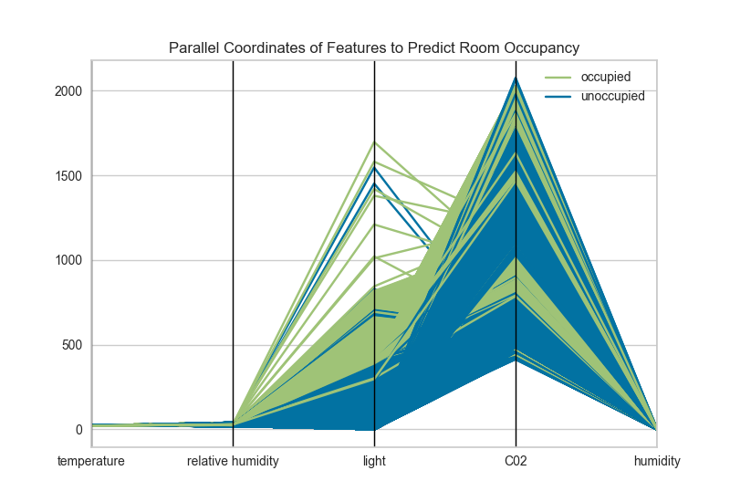
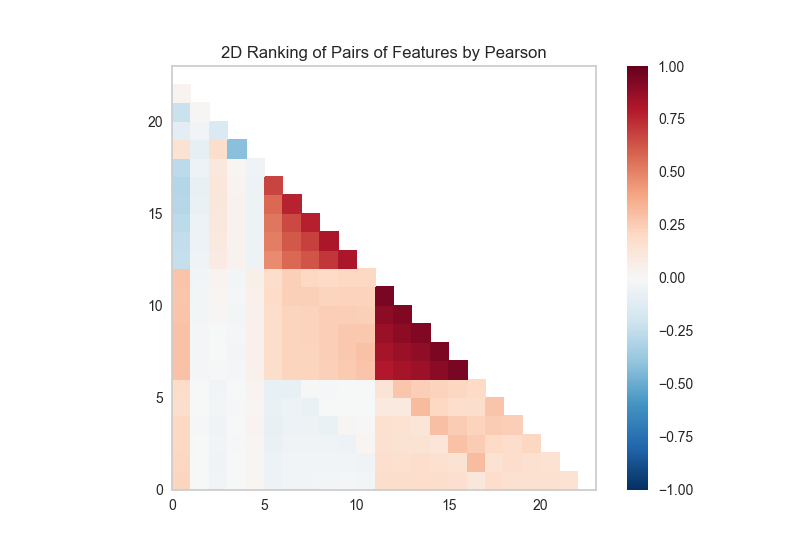

# Gallery

## Which Features Do I Use? _(Column 1)_

Given labelled data about rooms ...
- Which features are most predictive?
- Empty or occupied?

Use Radial Visualizations or Parallel Coordinates to look for class separability!




Given labelled data about credit card default ...
- Feature relationships?
- Correlations and/or collinearity?

Use Rank2D for pairwise feature analysis!





## Working with Text Data _(Column 2)_


## The API _(Column 3)_

### Scikit-Learn

Scikit-Learn has so many models, and its API makes automated model selection very convenient!

```
from sklearn.svm import SVC
from sklearn.naive_bayes import GaussianNB
from sklearn.ensemble import AdaBoostClassifier
from sklearn.neighbors import KNeighborsClassifier
from sklearn.ensemble import RandomForestClassifier


from sklearn import cross_validation as cv

classifiers = [
    KNeighborsClassifier(5),
    SVC(kernel="linear", C=0.025),
    RandomForestClassifier(max_depth=5),
    AdaBoostClassifier(),
    GaussianNB(),
]

kfold  = cv.KFold(len(X), n_folds=12)
max([
    cv.cross_val_score(model, X, y, cv=kfold).mean
    for model in classifiers
])
```

Except...
- search is difficult, particularly in high dimensional space.
- even with clever optimization techniques, there is no guarantee of a solution.
- as the search space gets larger, the amount of time increases exponentially.

### Enter Yellowbrick

Yellowbrick is a new Python library that:
- extends the Scikit-Learn API to incorporate visualizations into the machine learning workflow.
- enhances the model selection process with tools for feature visualization, visual diagnostics, and visual steering.

### Interface

In Scikit-Learn:

```
# Import the estimator
from sklearn.linear_model import Lasso

# Instantiate the estimator
model = Lasso()

# Fit the data to the estimator
model.fit(X_train, y_train)

# Generate a prediction      
model.predict(X_test)
```

With Yellowbrick:

```
# Import the model and visualizer
from sklearn.linear_model import Lasso
from yellowbrick.regressor import PredictionError

# Instantiate the visualizer
visualizer = PredictionError(Lasso())

# Fit
visualizer.fit(X_train, y_train)

# Score and visualize   
visualizer.score(X_test, y_test)
visualizer.poof()
```

Result:


### Matplotlib
All Yellowbrick visualizers are built with Matplotlib using the pyplot API. Yellowbrick is not a replacement for other visualization libraries - it's specifically for machine learning.

## Which Model Should I Use? _(Column 4)_

[concrete_ridgecv_residuals](figures/concrete_ridgecv_residuals.png)


## How Do I Tune My Model? _(Column 5)_


!
