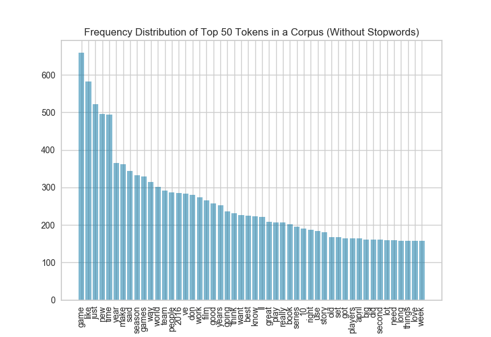
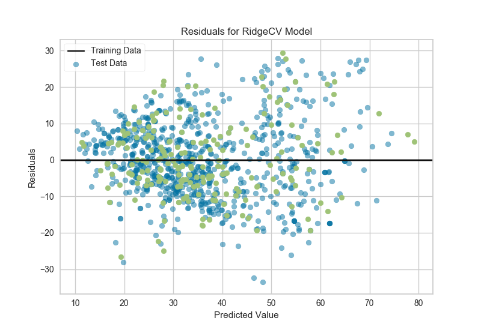
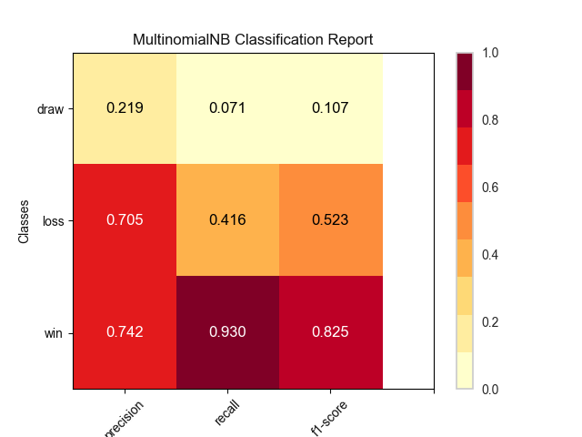

# Gallery

## Which Features Do I Use? _(Column 1)_

Given labelled data about rooms &hellip;

- Which features are most predictive?
- Empty or occupied?

### Radviz and ParallelCoordinates

Use Yellowbrick Radial Visualizations or Parallel Coordinates to look for class separability!


### Rank2D

Given labelled data about credit card default &hellip;

- Feature relationships?
- Correlations and/or collinearity?

Use Yellowbrick Rank2D for pairwise feature analysis!


## Working with Text Data _(Column 2)_

Text data is notoriously high-dimensional and hard to visualize. Yellowbrick can help!

### Frequency Distributions

Visualize important word features, before stopwords removal &hellip;



&hellip; and after!


### t-SNE

Visualize the distribution of corpus documents in 2 dimensions:


### Part-of-Speech Tags

How well is our regex part-of-speech tagger labelling with Penn-Treebank tags?


Depends on the text!


## The API _(Column 3)_

### Scikit-Learn

Scikit-Learn has so many models, makes automated model selection very convenient!

```
from sklearn.svm import SVC
from sklearn.naive_bayes import GaussianNB
from sklearn.ensemble import AdaBoostClassifier
from sklearn.neighbors import KNeighborsClassifier
from sklearn.ensemble import RandomForestClassifier


from sklearn import cross_validation as cv

classifiers = [
    KNeighborsClassifier(5),
    SVC(kernel="linear", C=0.025),
    RandomForestClassifier(max_depth=5),
    AdaBoostClassifier(),
    GaussianNB(),
]

kfold  = cv.KFold(len(X), n_folds=12)
max([
    cv.cross_val_score(model, X, y, cv=kfold).mean
    for model in classifiers
])
```

Except &hellip;

- search is difficult, high dimensional.
- even with clever optimization, no guaranteed solution.
- time increases exponentially with search space.

The Model Selection Triple (Arun Kumar, et al):


### Enter Yellowbrick

Yellowbrick is a new Python library that:

- extends the Scikit-Learn API.
- enhances the model selection process.
- provides visual tools for feature analysis, diagnostics & steering.

### Interface

In Scikit-Learn:

```
# Import the estimator
from sklearn.linear_model import Lasso

# Instantiate the estimator
model = Lasso()

# Fit the data to the estimator
model.fit(X_train, y_train)

# Generate a prediction      
model.predict(X_test)
```

With Yellowbrick:

```
# Import the model and visualizer
from sklearn.linear_model import Lasso
from yellowbrick.regressor import PredictionError

# Instantiate the visualizer
visualizer = PredictionError(Lasso())

# Fit
visualizer.fit(X_train, y_train)

# Score and visualize   
visualizer.score(X_test, y_test)
visualizer.poof()
```

<!-- Result:

 -->

### Matplotlib

All Yellowbrick visualizers are built with Matplotlib using the pyplot API. Yellowbrick is not a replacement for other visualization libraries - it's specifically for machine learning.


## Which Model Should I Use? _(Column 4)_

### Prediction Error and Residuals Plot

Visualize the distribution of error to diagnose heteroscedasticity:





### ROCAUC, Classification Report, and Confusion Matrix

ROCAUC helps us see overall accuracy:


Classification heatmap helps distinguish Type I & Type II error:



Confusion matrix shows us error on a per-class basis:


### Class Balance

What to do with a low-accuracy classifier? Check for imbalance!


&hellip;that's a visual cue to try stratified sampling, oversampling, or getting more data!


## How Do I Tune My Model? _(Column 5)_

### Elbow Curves and Silhouette Scores

- How do you pick an initial value for k in k-means clustering?
- How do you know whether to increase or decrease k?
- Is partitive clustering the right choice?

Higher silhouette scores mean denser, more separate clusters:


The elbow shows the best value of k &hellip; or suggests a different algorithm:


### Alpha Selection

Should I use Lasso, Ridge, or ElasticNet?


Is regularization even working??
